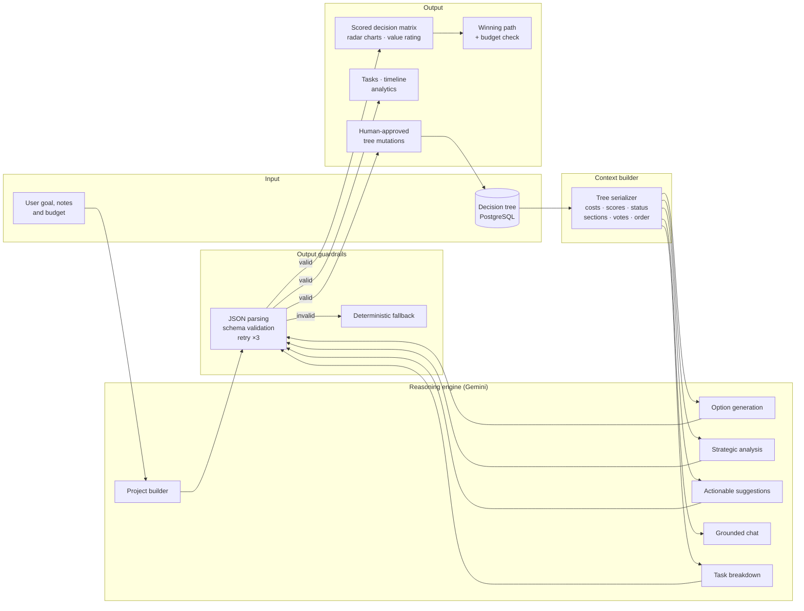

# Decider – AI Decision Engine

[](https://github.com/rmazurek2001-dot/decider/actions/workflows/ci.yml)


**Decider turns messy, multi-step planning problems into an interactive decision tree, where an LLM generates scored options, audits the plan, and proposes changes you can apply in one click.**

---

## Problem Statement

Real-world decisions such as organising a wedding, planning a trip or scoping a renovation are rarely a single choice. They are a **tree of dependent decisions**, each with several options that trade off cost, risk, time and personal satisfaction, all under one shared budget.

People handle this badly in predictable ways:

- **Cognitive overload**: once there are more than a handful of options per step, comparing them on several criteria at once becomes guesswork.
- **Decision biases**: anchoring on the first option, optimism about cost and risk, and ignoring "boring" items such as contingency buffers.
- **Lost global view**: a locally attractive choice quietly breaks the overall budget.

Decider uses an LLM as a **structured reasoning partner**, not an oracle. The model proposes alternatives and critiques the plan, and every output is forced into a validated schema and scored on explicit criteria. The final call stays with the user, who can see why one path ranks above another.

## Architecture & Workflow



**Request lifecycle (example: generating options for a node)**

1. The React UI calls `POST /api/decision-nodes/{id}/generate_subnodes/`.
2. The backend builds context from the parent node, the project goal and the remaining budget.
3. Gemini is asked for exactly three options, each with a cost and four 0–100 scores (`comfort`, `risk`, `time`, `pleasure`).
4. The response is stripped of markdown fences, parsed and checked against the schema. Scores out of range, a missing key or the wrong option count each trigger a retry, up to three attempts.
5. Valid options are saved as child nodes. The UI recomputes the per-node value rating and the **winning path** (the best non-rejected option per milestone, with risk inverted) and flags any branch whose root-to-leaf cost exceeds the budget.

## Key Features

- **Structured LLM outputs with guardrails**: every JSON response is stripped of markdown fences, parsed and checked against the expected schema (required keys, option count, 0–100 score ranges). Failed checks are retried up to three times, so invalid JSON never reaches the database.
- **Multi-criteria decision scoring**: each option is scored on four dimensions. The frontend combines them into a value rating, radar charts and a winning path, and the backend enforces a hard budget rule along every path.
- **Context engineering**: the decision tree is serialised into an indented, information-dense prompt context (cost, status, scores, section, chronological order, peer votes, aggregate averages). Analysis, suggestions and chat all reason over the same view of the project.
- **LLM proposes, human approves**: the advisor returns typed actions (`update_node_status`, `update_node_scores`, `update_node_cost`, `add_buffer_node`) instead of free text. The user applies them one by one, and the backend runs them through explicit handlers, never `eval`.
- **Notes-to-plan generation**: free-form notes plus a budget become a full nested project (milestones, options, sections, ordering, scores) in a single structured call.
- **Graceful degradation**: if no API key is set, AI endpoints return `503`. If the model keeps failing, the advisor falls back to a rule-based budget analysis, so the app stays usable.
- **Collaboration**: read-only public sharing via UUID token, plus per-session voting on options, which feeds back into the LLM context.
- **From decision to execution**: AI-generated task lists per node, a global action board, threaded comments, actual-vs-estimated expense tracking, a project timeline and an analytics dashboard.
- **Templates**: one-click starter projects (wedding, vacation, renovation) with pre-scored options.

## Tech Stack

| Layer | Technologies |
|---|---|
| LLM | Google Gemini (`gemini-2.5-flash`, configurable via `GEMINI_MODEL`), `google-generativeai` SDK |
| Backend | Python 3.11+, Django 5, Django REST Framework, `logging` |
| Data | PostgreSQL 16 (SQLite in tests) |
| Frontend | React 18, TypeScript, Vite, React Flow, Dagre (auto-layout), Recharts, Tailwind CSS, Framer Motion |
| Export | jsPDF + html2canvas (PDF reports) |
| Quality | pytest + pytest-django (LLM mocked), Playwright E2E + visual regression, Ruff (lint + isort), GitHub Actions |
| Infra | Docker, Docker Compose |

## Quickstart

### Option A: Docker (recommended)

```bash
git clone https://github.com/rmazurek2001-dot/decider.git
cd decider
cp .env.example .env          # then set GEMINI_API_KEY
docker compose up --build
docker compose exec backend python manage.py migrate
```

- Frontend: http://localhost:5173
- API: http://localhost:8000/api/

A Gemini API key is free at [Google AI Studio](https://aistudio.google.com/app/apikey). Without one, the app still runs and the AI features return `503`.

### Option B: Local development

```bash
# Backend
python -m venv .venv
source .venv/bin/activate        # Windows: .venv\Scripts\activate
pip install -r backend/requirements-dev.txt
cp .env.example .env             # set GEMINI_API_KEY; DB_HOST=localhost for a local Postgres
cd backend
python manage.py migrate
python manage.py runserver

# Frontend (second terminal)
cd frontend
npm ci
npm run dev
```

### Tests & lint

```bash
# Backend: in-memory SQLite, LLM mocked, no API key needed
cd backend
pytest
ruff check .

# Frontend E2E (app must be running on :5173)
cd frontend
npx playwright install chromium
npm run test:e2e
```

## API Overview

| Method | Endpoint | Description |
|---|---|---|
| `GET/POST` | `/api/projects/` | List / create projects |
| `GET` | `/api/projects/{id}/tree/` | Nested decision tree |
| `GET` | `/api/projects/{id}/analyze_project/` | AI summary, risks, missing items, recommendations |
| `GET` | `/api/projects/{id}/get_suggestions/` | AI typed change proposals |
| `POST` | `/api/projects/{id}/apply_suggestion/` | Apply one approved proposal |
| `GET/POST` | `/api/projects/{id}/chat/` | Project-grounded chat with history |
| `POST` | `/api/projects/build_from_notes/` | Generate a full project from notes |
| `GET` | `/api/projects/templates/` | List project templates |
| `POST` | `/api/projects/create_from_template/` | Create a project from a template |
| `GET` | `/api/projects/{id}/analytics/` | Budget, scoring and progress analytics |
| `POST` | `/api/decision-nodes/{id}/generate_tasks/` | AI task breakdown for a node |
| `CRUD` | `/api/tasks/`, `/api/comments/` | Tasks and comments |
| `POST` | `/api/decision-nodes/{id}/generate_subnodes/` | Generate 3 scored options (rate-limited) |
| `POST` | `/api/decision-nodes/{id}/vote/` | Vote for an option (one per session) |
| `GET` | `/api/public/projects/{token}/tree/` | Public read-only tree |

## Project Structure

```
backend/
  config/                 Django settings, URLs, test settings
  core/
    models.py             Project, DecisionNode, Vote, ChatMessage
    serializers.py        Tree serialization, path-cost budget validation
    views.py              REST endpoints, LLM context builder, suggestion executor
    services/
      ai_service.py       Gemini client: prompts, JSON guardrails, retries
      template_service.py Starter project templates
    tests/                pytest suite (mocked LLM)
frontend/
  src/components/         Tree visualizer, node cards, AI advisor, chat, timeline, analytics
  src/utils/              Layout, public API and PDF export helpers
  src/i18n/               EN / PL translations
  tests/e2e/              Playwright E2E and visual regression tests
docker-compose.yml
```

## Roadmap

- User-defined criterion weights for the value rating and winning path (currently equal weights, with risk inverted)
- Native JSON mode / response schemas via the newer `google-genai` SDK
- Authentication and per-user projects
- Evaluation set for prompt regression testing
